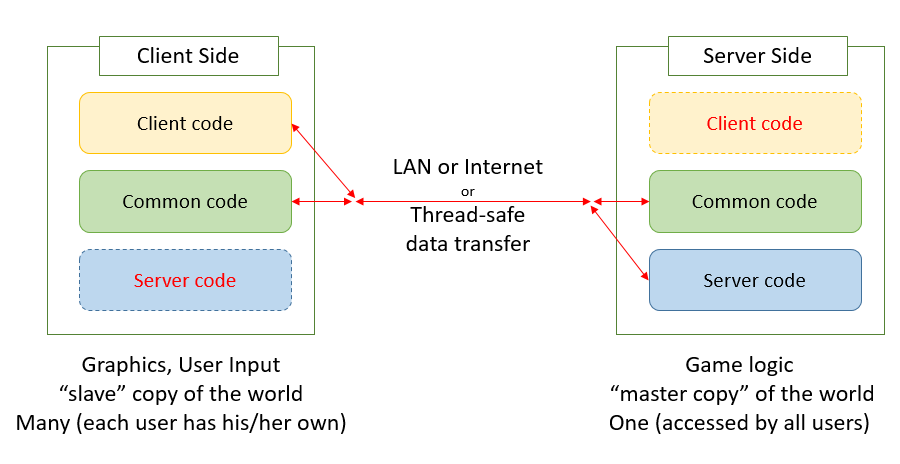

# 「客户端」和「服务端」的区分

Minecraft的代码可以区分为两个「端」——「客户端」和「服务端」

- 「服务端」负载维护游戏世界的主备份，例如：基于「客户端」发来的数据包更新方块和实体，并且发送回更新好的信息给客户端
- 「客户端」主要负责读取来自玩家的输入并且渲染到屏幕上

对于一个服务器，会有一些的「客户端」连接到它上。即使在本地计算机的单人游戏模式，「服务端」和「客户端」的代码也是同时运行的（在不同的线程上）。

有一部分的代码是被客户端和服务端同时使用的。举例来说，客户端和服务端都需要那些方块类中描述了方块的行为的代码。原版将这些类分成了三组：「客户端」、「服务器」，其他剩下的类属于「通用」。

如果「客户端」和「服务端」都有可能执行你写的代码，如何才能知道哪一个「端」正在调用你的代码呢？

你的方法基本上都会提供`World`对象，或者一个对象里有`World`类型的字段（一般来说字段名也叫做`world`）。

如果有的话你就可以：

- 如果`world.isRemote`为真，那么执行代码的就是客户端
- 如果`world.isRemote`为假，那么执行代码的就是服务端

作为最后的招数：

- `EffectiveSide.get() `的返回值是`Side.SERVER`或者`Side.CLIENT`。但是，你应该小心这个方法，因为它不是在所有情况下都有效的。

当「客户端」和「服务端」需要互相同步的时候，他们通过网络交换信息。即使是在单人游戏运行的时候，「客户端」和「服务端」也是完全分离且不能互相访问对方的实例。如果你的运行在「服务端」上的代码试图去访问属于客户端的对象实例，这会导致随机崩溃和奇怪的行为，所以请不要这么做！

我个人发现将我的mod分成下面三个顶级包会很有用：

- client
- common
- server

这帮助我清晰的记住哪些类是用在哪个「端」端，而且可以确保我不他们弄混。

---

[原文链接](http://greyminecraftcoder.blogspot.com/2020/02/the-client-server-division-1144.html)